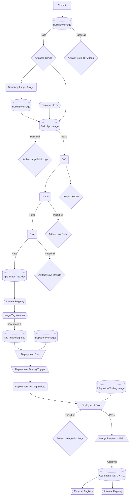

# sample-app

App Image Flow

```mermaid
graph TD
    A[Commit] --> B[(Build Env Image)]
    B --> |"Pass"|Z{Artifacts: RPMs}
    B --> |"Pass/Fail"|CC{Artifact: Build RPM logs}
    Z --> C
    C(Build App Image Trigger) --> D
    D[(Build Env Image)] --> AA
    BB([requirements.txt]) --> AA[(Build App Image)]
    Z --> AA
    AA --> |"Pass/Fail"|Y{Artifact: App Build Logs}
    AA --> |"Pass"|E(Syft)
    E --> F(Grype)
    E --> G{Artifact: SBOM}
    F --> |"Pass"|H(Dive)
    F --> |"Pass/Fail"|I{Artifact: Vul Scan}
    H --> |"Pass"|J[(App Image Tag: dev)]
    J --> DD>Internal Registry]
    H --> |"Pass/Fail"|K{Artifact: Dive Results}
    DD --> L{{Image Tag Watcher}}
    L --> |"new image #"|M[(App Image tag: dev)]
    M --> N[\Deployment Env/]
    O[(Depedency Images)] --> N
    N --> P[\Deployment Testing Trigger\]
    P --> Q(Deployment Testing Scripts)
    Q --> R[\Deployment Env/]
    S[(Integration Testing Image)] --> R
    R --> |"Pass/Fail"|X{Artifact: Integration Logs}
    R --> |"Pass"|T[/Merge Request > Main\]
    T --> |"Approval"|U[(App Image Tag: v X.Y.Z)]
    U --> V>External Registry]
    U --> W>Internal Registry]
```